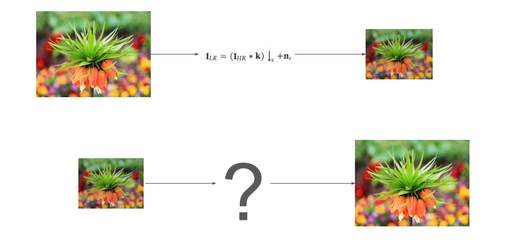

 ## Image SuperResolution(ISR) using Random Forest Regressor(RFSR) and Support Vector Regressor(SVR) Machine learning Models:-

## 1. Problem Statement
<h1 align="center">Image super-resolution (ISR) focuses on enhancing low-resolution (LR) images into high-resolution (HR) counterparts. This study explores three distinct machine learning approaches: residual learning with Random Forest (RFSR), channel-wise super-resolution using Support Vector Machines (SVMs), and patch-based Random Forest regression. These methods aim to address the challenge of reconstructing fine details like edges and textures in LR images while evaluating performance using metrics such as Structural Similarity Index (SSIM) and Mean Absolute Error (MAE).</h1>

 
  

## I. Dataset Description:
The dataset consists of paired 50 low-resolution (LR) and 50 high-resolution (HR) images. LR images are smaller in size and lack fine details, while HR images serve as the target for reconstruction. Each image is divided into patches for training and prediction, with LR patches flattened as input features and HR center pixels used as targets

## II. EDA:

 
  

Figure 1. (Distributions of images - Denoising)

## 2. Methodologies:

### 2.1 Random Forest Based Super-Resolution (RFSR) on Y-channel:
This methodology applies residual learning to reconstruct the difference between bicubic-upscaled LR images and their HR counterparts: 
•Preprocessing: Convert images to the YCbCr colorspace, focusing on the Y-channel for structural details. 
•Patch Extraction: Overlapping LR and HR patches are paired, and bicubic interpolation is used to match dimensions. 
•Model Training: A Random Forest Regressor predicts residual patches for the Y-channel. 
•Output:Combine predicted residuals with bicubic-upscaled patches to generate HR images. 

### 2.2 Patch-Based ISR Using Support Vector Machines (SVMs):
This approach focuses on reconstructing HR images channel-wise using SVM models: 
Steps: 
1.Extract and normalize LR and HR patches. 
2.Train SVM models for individual RGB channels. 
3.Predict HR patches using the trained models. 
4.Combine channel-wise predictions to reconstruct HR images. 
Advantages: Allows flexibility in patch size and improves channel-specific reconstructions. 

### 2.3 Patch-Based Regression with Random Forests:
A patch-based learning approach where overlapping patches are used to train Random Forest regressors for each color channel (R, G, B): 
1.Extract LR and HR patch pairs (Pi = (Li, Hi)) 
2.Train regressors to predict HR patches from LR inputs. 
3.Reconstruct HR images by combining predicted patches. 

## Models to implment:
1. Forest Based SISR (have code)
   1. [paper](papers/random_forests.pdf)
   2. [code](https://github.com/jshermeyer/RFSR)
2. [optional] Local Regression Based SISR (need to code; will be easy)
   1. [paper](papers/local_regression.pdf)

