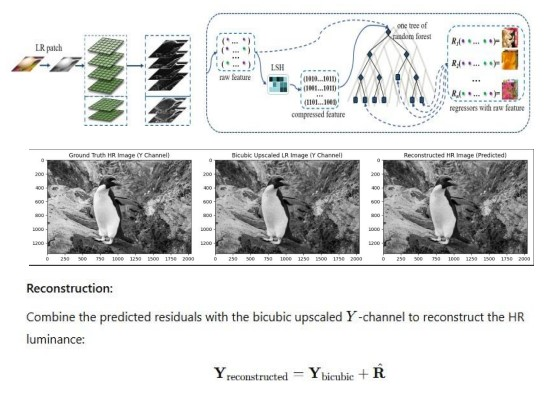

 ## Image SuperResolution(ISR) using Random Forest Regressor(RFSR) and Support Vector Regressor(SVR) Machine learning Models:-

## 1. Problem Statement

Image super-resolution (ISR) focuses on enhancing low-resolution (LR) images into high-resolution (HR) counterparts. This study explores three distinct machine learning approaches: Residual learning with Random Forest (RFSR), Channel-wise super-resolution using Support Vector Machines (SVMs), and Patch-based Random Forest regression. These methods aim to address the challenge of reconstructing fine details like edges and textures in LR images while evaluating performance using metrics such as Structural Similarity Index (SSIM) and Mean Absolute Error (MAE).

 
  

## 1.1. Dataset Description:

The dataset consists of paired 50 low-resolution (LR) and 50 high-resolution (HR) images. LR images are smaller in size and lack fine details, while HR images serve as the target for reconstruction. Each image is divided into patches for training and prediction, with LR patches flattened as input features and HR center pixels used as targets.

## 1.2. EDA:

 
  

Figure 1. (Distributions of images - Denoising)

## 2. Methodologies:

### 2.1 Random Forest Based Super-Resolution (RFSR) on Y-channel:

 This methodology applies residual learning to reconstruct the difference between bicubic-upscaled LR images and their HR counterparts: 

1. Preprocessing: Convert images to the YCbCr colorspace, focusing on the Y-channel for structural details. 
2. Patch Extraction: Overlapping LR and HR patches are paired, and bicubic interpolation is used to match dimensions. 
3. Model Training: A Random Forest Regressor predicts residual patches for the Y-channel. 
4. Output:Combine predicted residuals with bicubic-upscaled patches to generate HR images. 

 
  

### 2.2 Patch-Based ISR Using Support Vector Machines (SVMs):

This approach focuses on reconstructing HR images channel-wise using SVM models: 
Steps: 
 
1. Extract and normalize LR and HR patches. 
2. Train SVM models for individual RGB channels. 
3. Predict HR patches using the trained models. 
4. Combine channel-wise predictions to reconstruct HR images. 

Advantages: Allows flexibility in patch size and improves channel-specific reconstructions.  

 
  

### 2.3 Patch-Based Regression with Random Forests:

 A patch-based learning approach where overlapping patches are used to train Random Forest regressors for each color channel (R, G, B): 

1. Extract LR and HR patch pairs (Pi = (Li, Hi)) 
2. Train regressors to predict HR patches from LR inputs. 
3. Reconstruct HR images by combining predicted patches. 

## 3. Models
### 3.1 Support Vector Machines (SVM)

 Utilizes kernels to handle complex, high-dimensional data. 
1. Predicts pixel values for each RGB channel independently. 

### 3.2 Random Forest Regressor

 1. Trained on LR-HR patch pairs. 
2. Handles patch-based mapping for each RGB channel.  

   
### 3.3 Random Forest Super-Resolution (RFSR)

 1. Uses a residual learning approach to predict the missing fine details (edges, textures). 
2. Targets only the Y-channel (structural details) in the YCbCr color space.Employs Random Forest Regressors trained on residual patches for enhancement.  

## 4. Analysis
### 4.1 Metrics: 

 SSIM for structural quality, MAE for pixel error. 

### 4.2 Performance: 

 RFSR excels in edges, SVMs in color precision, and Random Forest regression in consistency. 

 
  

### 4.3 Challenges: 

 Minor artifacts from patch reconstruction; occasional color mismatches in YCbCr conversion. Periodic diagonal streaks appear on the predicted HR patches due to crude pixel features. 

## 6. Conclusion and Future Scope:

 This study highlights the efficacy of machine learning approaches in ISR, outperforming traditional bicubic interpolation in both visual quality and numerical metrics. The patch-based methods (RFSR and Random Forest regression) exhibited high structural integrity, while SVMs excelled in color consistency.

 
  

## 7. References

1. Ni, Karl S. and Truong Q. Nguyen. “Image Super resolution Using Support Vector Regression.” IEEE Transactions on Image Processing 16 (2007): 1596-1610.
2. L. An and B. Bhanu, "Improved image super-resolution by Support Vector Regression," The 2011 International Joint Conference on Neural Networks, San Jose, CA, USA, 2011, pp. 696-700, doi: 10.1109/IJCNN.2011.6033289.
3. Jianchao Yang, J. Wright, T. Huang and Yi Ma, "Image super-resolution as sparse representation of raw image patches," 2008 IEEE Conference on Computer Vision and Pattern Recognition, Anchorage, AK, USA, 2008, pp. 1-8, doi: 10.1109/CVPR.2008.4587647.
4. Ni, Karl S. and Truong Q. Nguyen. “Image Superresolution Using Support Vector Regression.” IEEE Transactions on Image Processing 16 (2007): 1596-1610.
5. Jianchao Yang, Student Member, IEEE, John Wright, Member, IEEE, Thomas S. Huang, Fellow, IEEE, and Yi Ma, Senior Member, IEEE.
6. H. Li, K.-M. Lam, and M. Wang, "Image Super-resolution via Feature-augmented Random Forest," Pattern Recognition
Letters, vol. 108, pp. 31–37, 2018, doi: 10.1016/j.patrec.2018.01.014 

