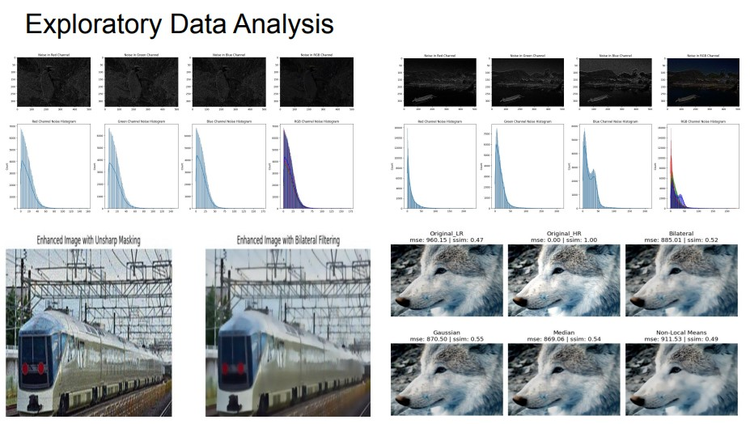

## Image SuperResolution(ISR) using Random Forest Regressor(RFSR) and Support Vector Regressor(SVR) Machine learning Models:-

## Problem Statement
Image super-resolution (ISR) focuses on enhancing low-resolution (LR) images into high-resolution (HR) counterparts. This study explores three distinct machine learning approaches: residual learning with Random Forest (RFSR), channel-wise super-resolution using Support Vector Machines (SVMs), and patch-based Random Forest regression. These methods aim to address the challenge of reconstructing fine details like edges and textures in LR images while evaluating performance using metrics such as Structural Similarity Index (SSIM) and Mean Absolute Error (MAE).

 
  

## Dataset Description:
The dataset consists of paired 50 low-resolution (LR) and 50 high-resolution (HR) images. LR images are smaller in size and lack fine details, while HR images serve as the target for reconstruction. Each image is divided into patches for training and prediction, with LR patches flattened as input features and HR center pixels used as targets

## EDA:

 
  

## Models to implment:
1. Forest Based SISR (have code)
   1. [paper](papers/random_forests.pdf)
   2. [code](https://github.com/jshermeyer/RFSR)
2. [optional] Local Regression Based SISR (need to code; will be easy)
   1. [paper](papers/local_regression.pdf)

